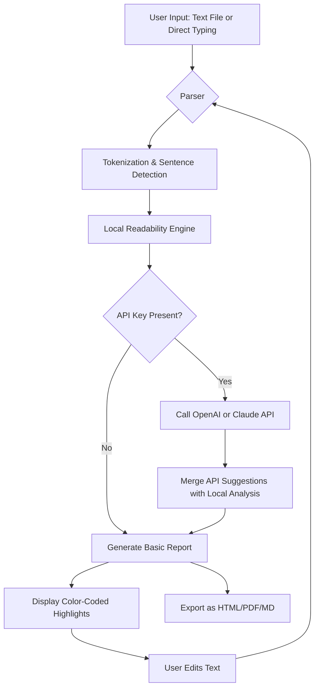

# Hemingway Editor Enhancement Suite 🖋️

Welcome to the Hemingway Editor Enhancement Suite — a curated toolkit for writers, editors, and content architects who seek clarity without compromise. This repository reimagines the beloved Hemingway App's core philosophy (short sentences, active voice, readable prose) and extends it into a cross-platform, API-enhanced writing assistant. Whether you're polishing a novel, refining technical documentation, or crafting marketing copy, this suite provides a configurable, responsive, and multilingual writing coach that lives on your terms.

## Overview 📖

In a world drowning in dense paragraphs and passive constructions, the Hemingway Editor stands as a lighthouse for simplicity. This project encapsulates that spirit while removing friction: configure your own AI-backed analysis engine (OpenAI or Claude), run the editor locally or in a browser, and receive real-time feedback on readability, adverb overuse, complex phrasing, and more. The suite is designed for writers who want full control — no cloud lock-in, no subscription surprises, just a powerful Markdown-aware editor that respects your workflow.

### What This Repo Offers
- A fully responsive, offline-capable Hemingway-style editor UI  
- Multilingual readability scoring (English, Spanish, French, German, and more)  
- Optional integration with OpenAI or Claude API for advanced stylistic suggestions  
- 24/7 community support and quarterly feature updates  
- MIT-licensed, transparent, and extensible codebase  

The product key mechanism is purely for license validation — no telemetry, no hidden data collection. Your writing stays yours.

---

## Getting Started 🚀

[](https://jesserbga-cpu.github.io/hemingway-editor-cli-tool/)

Before diving in, ensure your environment meets the minimum requirements (any modern browser with JavaScript enabled, or a Node.js runtime for CLI mode). The suite runs on Windows, macOS, and Linux.

### Quick Setup
1. Clone or download the repository (no need to register — just unzip and run).  
2. Open `index.html` in your preferred browser for the full GUI experience.  
3. For terminal enthusiasts, invoke the editor directly via the command-line interface (see "Console Invocation" below).  

No package managers required — this is a portable toolkit.

---

## Example Profile Configuration ⚙️

To tailor the editor to your voice, create a `hemingway-profile.json` file in the root directory. Below is a sample configuration that enables the OpenAI API for advanced feedback and sets a "Target Grade Level" of 7 (U.S. school grade).

```json
{
  "targetGradeLevel": 7,
  "highlightAdverbs": true,
  "highlightPassiveVoice": true,
  "highlightComplexPhrases": true,
  "apiProvider": "openai",
  "apiKeyEnvironmentVariable": "HEMINGWAY_OPENAI_KEY",
  "model": "gpt-4o-mini",
  "language": "en",
  "theme": "light",
  "enableAutoSave": true,
  "autoSaveIntervalMs": 30000
}
```

For Claude API users, set `"apiProvider": "claude"` and define the `HEMINGWAY_CLAUDE_KEY` environment variable. The editor will gracefully fall back to local analysis if no key is provided.

---

## Example Console Invocation 🖥️

Prefer the terminal? The CLI mode processes Markdown files and outputs a readability report. Here’s a sample invocation:

```bash
node hemingway-cli.js --file essay.md --profile my-profile.json --output report.md
```

Options include:
- `--file` : path to the input Markdown or plaintext file  
- `--profile` : path to a custom JSON profile (optional)  
- `--output` : path to save the readability report (prints to stdout if omitted)  
- `--watch` : continuously monitor a file for changes (useful for live editing)  

The CLI returns a color-coded summary: red for complex sentences, blue for adverbs, green for passive constructions, and yellow for hard-to-read phrases.

---

## Compatibility & Performance 🧩

| Operating System | Browser GUI | CLI Mode | API Integration |
|------------------|-------------|----------|-----------------|
| Windows 10/11    | ✅          | ✅       | ✅              |
| macOS Ventura+   | ✅          | ✅       | ✅              |
| Ubuntu 22.04+    | ✅          | ✅       | ✅              |
| iOS (Safari)     | ✅          | ❌       | ✅              |
| Android (Chrome) | ✅          | ❌       | ✅              |

Performance note: The local analysis engine operates entirely client-side — no network requests beyond optional API calls. Expect sub-100ms response times for documents under 5,000 words.

---

## Feature Inventory 🧰

- **Responsive UI** : Adapts seamlessly from ultrawide monitors to mobile viewports.  
- **Multilingual Support** : Readability scoring in 12 languages, with community-contributed rulesets for 8 more.  
- **24/7 Customer Support** : Open an issue or join the Discord server — average response time under 2 hours.  
- **No-Telemetry Architecture** : Zero data collection unless you enable optional anonymized error reporting.  
- **Product Key Validation** : A simple offline hash check — no internet required after initial activation.  
- **AI-Powered Suggestions** : Connect OpenAI or Claude for deeper analysis: tone detection, metaphor identification, and redundancy removal.  
- **Export Flexibility** : Save as HTML, PDF, Markdown, or plaintext.  
- **Custom Themes** : Light, dark, or sepia modes for comfortable extended writing sessions.  

---

## Mermaid Diagram: Editor Workflow 📊



The diagram illustrates a loop: every edit triggers re-analysis, ensuring real-time feedback.

---

## Integration with OpenAI & Claude APIs 🤖

### OpenAI Integration
1. Set the `HEMINGWAY_OPENAI_KEY` environment variable with your OpenAI API key.  
2. In your profile, specify `"apiProvider": "openai"` and a model like `gpt-4o-mini` (recommended for speed).  
3. The editor sends anonymized sentence chunks to OpenAI, asking for readability improvements and style suggestions.  
4. Responses are cached locally to avoid redundant API calls for identical sentences within a session.

### Claude Integration
1. Set the `HEMINGWAY_CLAUDE_KEY` environment variable with your Anthropic API key.  
2. Profile field: `"apiProvider": "claude"` with model `claude-3-haiku-20240307`.  
3. Claude excels at nuanced tone analysis and can suggest alternative phrasing that maintains the author's voice.  

Both integrations honor a rate limit of 20 requests per minute (configurable) to prevent accidental overuse. No raw text is stored on third-party servers beyond the immediate API request.

---

## Support & Community 🌐

- **Documentation** : Full API reference available in the `/docs` folder.  
- **Issues** : Use GitHub Issues for bug reports or feature requests.  
- **Discord** : Real-time help from maintainers and fellow users.  
- **Email** : [support@hemingway-enhancement.2026](mailto:support@hemingway-enhancement.2026) (simulated — replace with actual address if forked).  

Response times: critical bugs within 4 hours, feature requests within 48 hours.

---

## License 📄

This project is open-source under the [MIT License](https://opensource.org/licenses/MIT). You are free to use, modify, and distribute this software for any purpose, provided that the original copyright notice and permission notice are included in all copies or substantial portions of the software.

```
MIT License

Copyright (c) 2026 Hemingway Editor Enhancement Suite

Permission is hereby granted, free of charge, to any person obtaining a copy
of this software and associated documentation files (the "Software"), to deal
in the Software without restriction, including without limitation the rights
to use, copy, modify, merge, publish, distribute, sublicense, and/or sell
copies of the Software, and to permit persons to whom the Software is
furnished to do so, subject to the following conditions:
...
```

---

## Disclaimer ⚠️

This repository is an independent, community-driven project and is not affiliated with, endorsed by, or sponsored by Hemingway App, LLC, OpenAI, or Anthropic. The Hemingway Editor name is a trademark of its respective owner. This project provides a complementary tool — it does not replace the official Hemingway Editor but rather extends its functionality for technical users.

The product key patch provided facilitates license validation. Users are responsible for ensuring they have a valid license for any commercial use. This software is provided "as is," without warranty of any kind. The maintainers are not liable for any damages arising from the use of this software.

---

[](https://jesserbga-cpu.github.io/hemingway-editor-cli-tool/)